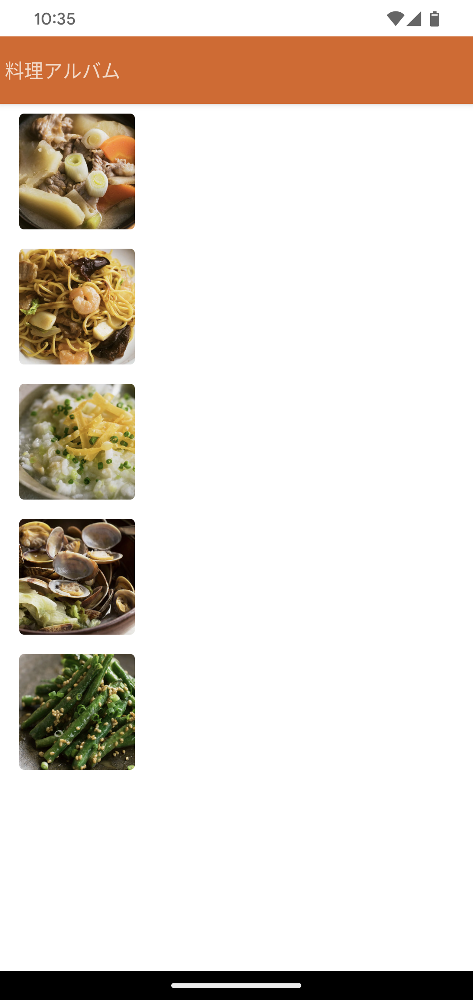

# おいしい健康Androidエンジニア選考課題
このリポジトリは株式会社おいしい健康のAndroidエンジニア向け選考課題です。本課題を与えられた方は下記の説明を読んだ上で課題を取り組んでください。

# アプリの仕様
「料理記録」アプリです。 レシピ画面の下部に、実際に作ったその料理の写真をちょっとしたコメントつきで残しておける機能です。
このアプリでは料理記録を一覧で表示しています。

## 環境
- Android Studio Chipmunk | 2021.2.1 Patch 2
- Kotlin 1.7.0
- Jetpack Compose 1.2.0
- Java 11
- Gradle 7.3.3
- minSDK 23
- target SDK 33

## API エンドポイント

実際のエンドポイントURLは、課題と共にお渡しするエンドポイントURLをご確認ください。 お渡しするURLをlocal.propertiesに記載することで実行可能になります。 

ここでは`https://[example.com]`として説明します。

### パラメータ例

`limit` :  一度のリクエストで取得する記録数を指定します。指定無しの場合は `10` とします。
`offset` : 取得する記録のオフセットを指定します。指定無しの場合は `0` とします。

例えば、記録が100件あるとして、51番目から5件の記録を取得したい場合には

`https://[example.com]/cooking_records?offset=50&limit=5`

と指定します。

### レスポンス例

レスポンス例

<pre>
{
  pagination: {
    total: 100,  # 総レコード数
    offset: 50,  # オフセット
    limit: 5     # リクエスト時指定の取得数
  },
  cooking_records: [
    {
      "image_url": "https://[example.com]/images/51.jpg", # 写真のURL
      "comment": "パンチのきいた辛味が印象的です。",                             # コメント
      "recipe_type": "main_dish",                                         # レシピの種類（main_dish: 主菜/主食, side_dish: 副菜, soup: スープ)
      "recorded_at": "2018-04-21 14:04:22"                                # 記録日時
    },
    {
      "image_url": "https://[example.com]/images/52.jpg",
      "comment": "ごまのコクと酸味がさわやかなタレを添えて。",
      "recipe_type": "main_dish",
      "recorded_at": "2018-04-20 14:04:42"
    },
    {
      "image_url": "https://[example.com]/images/53.jpg",
      "comment": "新鮮なとうもろこしのおいしさ。",
      "recipe_type": "soup",
      "recorded_at": "2018-04-19 14:05:41"
    },
    {
      "image_url": "https://[example.com]/images/54.jpg",
      "comment": "しょうゆとオイスターソースで味付けた具がたっぷり。",
      "recipe_type": "main_dish",
      "recorded_at": "2018-04-18 14:06:12"
    },
    {
      "image_url": "https://[example.com]/images/55.jpg",
      "comment": "豚バラ肉とゴーヤーで、夏バテも吹き飛びそうです。",
      "recipe_type": "main_dish",
      "recorded_at": "2018-04-17 14:07:40"
    }
  ]
}
</pre>

# 課題の取り組み方法

## 事前準備
本プロジェクトを [複製](https://docs.github.com/ja/repositories/creating-and-managing-repositories/duplicating-a-repository) してください(Forkしないようにしてください)。今後のコミットは全てご自身のリポジトリで行ってください。

## 課題説明

本プロジェクトを起動すると下記のような状態になります。このリポジトリは不完全な状態なので、Issueを取り組みアプリが完全な状態になることを目指してください。

## Issue説明

Issueを確認し課題をお渡しする際に指定されたラベルに対して取り組んでください。
Issueにはラベルを付与していますので、難易度の目安にお役立てください。

|ラベル名|必須|選択|
|--|--|--|
|初級|必須|任意|
|中級|必須|いずれか1つ以上を選択|

課題 Issueをご自身のリポジトリーにコピーするGitHub Actionsをご用意しております。
こちらのWorkflowを手動でトリガーすることでコピーできますのでご活用下さい。

# 課題の提出方法

課題が完成したら、リポジトリのアドレスを教えてください。

